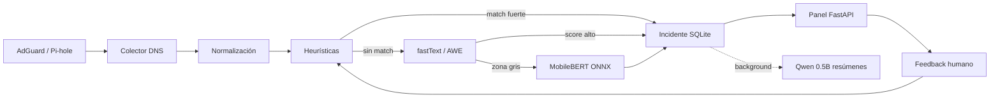
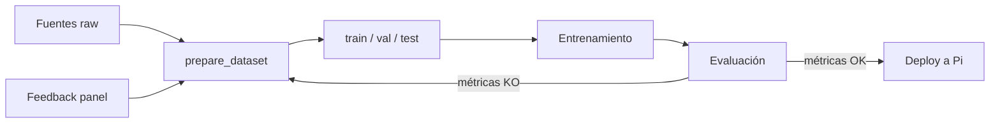
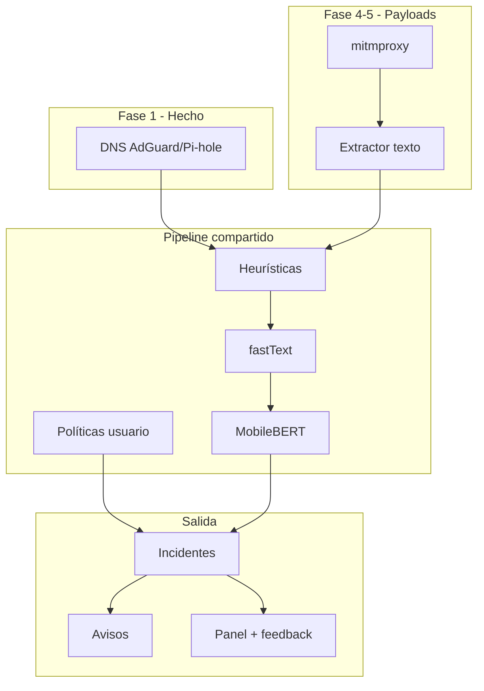

# PiholeBlocker

Filtro de red **local-first** para Raspberry Pi: captura eventos DNS y, en dispositivos gestionados, payloads HTTP(S) para clasificar riesgo con un pipeline escalonado (heurísticas → fastText → MobileBERT en zona gris). Expone un **gestor de contenidos** con políticas configurables, alertas y revisión humana. **No usa LLM generativo en el camino crítico.**

> Roadmap completo en [Roadmap de desarrollo](#roadmap-de-desarrollo).

## Arquitectura



### Principios de diseño

| Decisión | Motivo |
|----------|--------|
| DNS + payloads gestionados | DNS cubre toda la red; payloads solo con proxy + CA en dispositivos administrados |
| Pipeline escalonado | Latencia baja en la mayoría de muestras; modelo pesado solo en ambigüedad |
| LLM fuera del inline | Clasificación determinista para alertas/bloqueo; LLM solo resume en panel |
| Políticas configurables | El admin define categorías, severidad y acción (alert/block/log) |
| SQLite local | Offline, privacidad, feedback loop sin dependencias externas |
| Revisión humana | Reduce falsos positivos semánticos (HateXplain, EXIST, datasets ES) |

## Hardware recomendado

| Dispositivo | Rol |
|-------------|-----|
| **Raspberry Pi 5 (4–8 GB)** | Objetivo ideal: DNS + fastText + MobileBERT ocasional + panel |
| **Raspberry Pi 4 Model B** | MVP cómodo con mismos modelos, menos margen de RAM |
| **Raspberry Pi 3 B+** | Solo DNS + heurísticas + fastText |
| **Pi Zero 2 W** | Colector básico, no nodo de inferencia |

## Modelos

| Capa | Modelo | Tamaño | Uso |
|------|--------|--------|-----|
| 0 | Listas + regex | ~KB | Bloqueo inmediato (malware, grooming keywords) |
| 1 | fastText `.ftz` | ~1–2 MB | Clasificación barata por hostname/URL |
| 2 | MobileBERT cuantizado ONNX | ~28 MB | Solo zona gris (score 0.40–0.75) |
| 3 (opcional) | Qwen2.5-0.5B-Instruct Q4 | ~245 MB | Resúmenes de incidentes en panel, **nunca inline** |

Entrena capas 1–2 en máquina de desarrollo (GPU); despliega artefactos a la Pi.

### Datasets sugeridos (ES/EN)

- **EXIST 2023** — bilingüe EN/ES
- **Dataset Multidimensional de Ciberacoso en Español (2025)**
- **OLID**, **HateXplain** — complemento EN
- Corpus propio desde `feedback` + query log etiquetado

## Entrenamiento de modelos

El entrenamiento se realiza **en máquina de desarrollo** (PC con GPU opcional). En la Raspberry Pi solo se despliegan los artefactos finales (`.ftz`, `.onnx`).

### Flujo general



### Capa 1 — fastText (clasificador ligero)

| Paso | Acción | Herramienta / salida |
|------|--------|----------------------|
| 1. Recopilar | Descargar datasets y listas de dominios; exportar feedback del panel | CSV, JSON, listas `.txt` |
| 2. Preparar | Normalizar texto; mapear etiquetas; split 80/10/10 estratificado | `__label__clase texto` → `train.txt`, `val.txt`, `test.txt` |
| 3. Entrenar | Supervised training con n-grams | `fasttext.train_supervised()` → `.bin` |
| 4. Cuantizar | Comprimir para edge (~1–2 MB) | `model.quantize(input=train.txt, retrain=True)` → `.ftz` |
| 5. Evaluar | Macro-F1, recall por clase, FPR en `safe` | `evaluate.py` / `scripts/evaluate_model.py` |
| 6. Ajustar | Umbrales en `config.yaml` según curva de validación | `light_classifier_threshold`, `gray_zone_*` |
| 7. Desplegar | Copiar artefacto a `models/` en la Pi | `risk_classifier.ftz` |

**Hiperparámetros recomendados (fastText):**

```
epoch=25–50    lr=0.5    wordNgrams=2    minCount=2    dim=100
quantize: retrain=True, cutoff=1–5
```

**Métricas mínimas antes de desplegar:**

- Macro-F1 en test ≥ 0.80
- Recall `grooming_risk` ≥ 0.85
- FPR en `safe` < 5%

### Capa 2 — MobileBERT (segunda pasada, zona gris)

| Paso | Acción | Notas |
|------|--------|-------|
| 1. Subset hard | Filtrar muestras donde fastText falla o score ∈ zona gris | Ironía, contexto educativo, citas |
| 2. Fine-tune | MobileBERT en GPU | Model Maker LiteRT o Hugging Face (~25 min GPU vs horas en CPU) |
| 3. Exportar | ONNX cuantizado (~28 MB) | Incluir tokenizador |
| 4. Evaluar | Solo sobre subset hard | Objetivo: +5 pp F1 vs solo fastText |
| 5. Desplegar | `models/mobilebert_quantized.onnx` + ONNX Runtime Arm | Solo se invoca si fastText ∈ [gray_zone_min, gray_zone_max] |

### Capa 3 — LLM (opcional, no inline)

| Paso | Acción |
|------|--------|
| 1. Descargar | Qwen2.5-0.5B-Instruct Q4 (~245 MB) |
| 2. Configurar | `llm_enabled: true` en `config.yaml` |
| 3. Usar | Solo `/api/summary` — resúmenes de incidentes en background |

### Ciclo de mejora continua (feedback)

```
Panel (TP/FP) → export_feedback.py → append a train.txt → retrain → evaluate → deploy
```

- `fp` → nuevos ejemplos `safe`
- `tp` → refuerza etiqueta original
- `allow_rule` → whitelist + ejemplo safe

Programar reentrenamiento mensual o tras N feedbacks nuevos.

### Ejemplo práctico incluido

En [`examples/`](examples/) hay un tutorial autocontenido con corpus sintético (~300+ muestras):

```bash
pip install -e ".[ml]"
cd examples
python train.py          # genera datos si no existen, entrena y cuantiza
python evaluate.py       # métricas en test
python predict.py "google.com"

# Desplegar en el daemon
cp output/risk_classifier.ftz ../models/risk_classifier.ftz
```

Ver [examples/README.md](examples/README.md) para instrucciones detalladas.

## Inicio rápido

```bash
# Clonar e instalar
cd PiholeBlocker
python3 -m venv .venv && source .venv/bin/activate
pip install -e ".[ml]"

# Configuración
cp config/config.example.yaml config/config.yaml
# Editar credenciales AdGuard/Pi-hole

# Modelo fastText: ejemplo completo en examples/
cd examples && python train.py && cd ..
# o demo mínimo en scripts/
python scripts/train_fasttext.py

# Arrancar daemon + panel (puerto 8080)
pihole-blocker
```

### Docker (laboratorio)

```bash
docker compose up -d
# AdGuard UI: http://localhost:3000
# Panel PiholeBlocker: http://localhost:8080
```

## Despliegue en Raspberry Pi

```bash
sudo useradd -r -s /bin/false pihole-blocker
sudo mkdir -p /opt/pihole-blocker
sudo cp -r . /opt/pihole-blocker/
cd /opt/pihole-blocker
python3 -m venv .venv
.venv/bin/pip install -e ".[ml]"
sudo cp systemd/pihole-blocker.service /etc/systemd/system/
sudo systemctl enable --now pihole-blocker
```

Apunta el DNS de la red a la Pi (AdGuard/Pi-hole en `:53`).

## API

| Endpoint | Descripción |
|----------|-------------|
| `GET /` | Panel web |
| `GET /health` | Healthcheck |
| `GET /api/stats` | Métricas agregadas |
| `GET /api/incidents` | Lista de incidentes |
| `POST /api/incidents/{id}/feedback` | Veredicto: `tp`, `fp`, `ignore`, `allow_rule` |
| `GET /api/summary` | Resumen LLM opcional |

## Roadmap de desarrollo

Estado actual: **Fase 1 completada**. El sistema captura eventos DNS, aplica heurísticas + pipeline ML escalonado (placeholders) y expone panel con feedback humano.

Objetivo final: **gestor de contenidos local** que detecte riesgo en metadatos DNS (toda la red) y en payloads HTTP(S) (dispositivos gestionados), con alertas configurables y revisión humana.



---

### Fase 1 — DNS-first ✅

**Resumen:** Base operativa: captura de query log, persistencia local, heurísticas sobre hostnames y panel de revisión.

**Pasos técnicos:**
1. Colector AdGuard (`GET /control/querylog`) y Pi-hole (REST + SID de la instancia local).
2. Normalizar eventos a `{timestamp, client_ip, hostname, query_type, status}`.
3. Tablas SQLite: `events`, `incidents`, `feedback`, `pipeline_state`.
4. Motor heurístico: blocklists, TLD sospechosos, keywords (`pipeline/heuristics.py`).
5. Orquestador escalonado (`pipeline/orchestrator.py`).
6. Panel FastAPI con veredictos TP/FP/ignore/allow_rule.

**Entregables:** daemon `pihole-blocker`, Docker Compose con AdGuard, tests unitarios de heurísticas.

---

### Fase 2 — Clasificador ligero (fastText)

**Resumen:** Entrenar un modelo real sobre texto/dominios, cuantizarlo y sustituir el demo de 7 muestras.

**Pasos técnicos:**
1. Seguir el flujo de [Entrenamiento de modelos](#entrenamiento-de-modelos) y el tutorial [`examples/`](examples/).
2. Crear `scripts/prepare_dataset.py` (producción):
   - Ingestar EXIST 2023, dataset ciberacoso ES, OLID/HateXplain.
   - Mapear etiquetas externas → `safe`, `suspicious`, `abusive`, `grooming_risk`.
   - Añadir dominios de listas públicas (PhishTank, URLhaus) y negativos (Tranco, Majestic).
   - Exportar formato fastText: `__label__<clase> <texto>`.
   - Split estratificado 80/10/10 (train/val/test); mínimo ~5.000 muestras.
2. Ampliar `scripts/train_fasttext.py`:
   - Leer corpus real (no solo demo).
   - Hiperparámetros: `wordNgrams=2`, `epoch=25–50`, `lr=0.5`, `minCount=2`.
   - Cuantizar: `quantize(input=train.txt, retrain=True, cutoff=1–5)` → `.ftz`.
   - Versionar artefactos: `models/risk_classifier_vN.ftz`.
3. Crear `scripts/evaluate_model.py`:
   - Macro-F1, precisión/recall por clase, matriz de confusión.
   - Simular pipeline completo con umbrales de `config.yaml`.
   - Priorizar recall en `grooming_risk` y FPR bajo en `safe`.
4. Ajustar umbrales en `config/config.yaml` según curva val.
5. Desplegar `.ftz` a Pi; benchmark latencia p95 < 50 ms.

**Definition of Done:**
- [ ] Macro-F1 en test ≥ 0.80
- [ ] Recall `grooming_risk` ≥ 0.85
- [ ] FPR en clase `safe` < 5%
- [ ] Modelo cuantizado < 2 MB

---

### Fase 3 — Segunda pasada (MobileBERT ONNX)

**Resumen:** Modelo pesado solo para zona gris (score fastText entre `gray_zone_min` y `gray_zone_max`).

**Pasos técnicos:**
1. Preparar subset «hard»: muestras donde fastText falla o queda en zona gris (ironía, contexto educativo, citas).
2. Fine-tune MobileBERT en máquina con GPU (Model Maker LiteRT o Hugging Face).
3. Exportar a ONNX cuantizado (~28 MB); incluir tokenizador en el grafo o módulo Python emparejado.
4. Completar `HeavyClassifier` en `pipeline/classifier.py` (eliminar inputs dummy).
5. Instalar ONNX Runtime CPU Arm en Pi: `pip install onnxruntime`.
6. Evaluar solo sobre subset hard; benchmark p95 < 1 s en Pi 4/5.
7. Medir tasa de escalado (% muestras que llegan a capa 2); objetivo < 15% del tráfico.

**Definition of Done:**
- [ ] Mejora ≥ 5 pp macro-F1 vs solo fastText en subset hard
- [ ] p95 inferencia < 1000 ms en Pi 4
- [ ] RAM estable en operación 24 h

---

### Fase 4 — Captura de payloads (mitmproxy)

**Resumen:** Inspeccionar contenido web en dispositivos gestionados mediante proxy local con CA de confianza.

**Pasos técnicos:**
1. Añadir servicio mitmproxy en `docker-compose.yml` (modo WireGuard o local capture).
2. Generar CA local; documentar instalación del certificado en clientes gestionados.
3. Crear `scripts/mitm_addon.py` (addon mitmproxy):
   - Interceptar flujos HTTP/HTTPS.
   - Extraer: URL completa, método, título HTML, meta description, texto visible (≤ 1000 chars), campos POST texto, campos JSON legibles.
   - Ignorar binarios, CDN en whitelist, payloads > umbral.
   - POST a `http://127.0.0.1:8080/api/events/http` (endpoint nuevo).
4. Extender schema SQLite:
   - Campos en `events`: `source` (`dns`|`http`), `url`, `snippet`, `method`.
5. Extender orquestador: input = `url + snippet` (no solo hostname).
6. Configurar dispositivos gestionados: proxy apuntando a la Pi; DNS sin DoH.

**Limitaciones a documentar:** certificate pinning, E2EE (WhatsApp/Signal), ECH, QUIC/HTTP3 parcial, DoH/DoQ.

**Definition of Done:**
- [ ] Navegación HTTPS en cliente gestionado genera eventos con snippet
- [ ] Pipeline clasifica URL+texto correctamente
- [ ] Latencia añadida p95 < 100 ms en capa ligera

---

### Fase 5 — Motor de políticas (gestor de contenidos)

**Resumen:** Permitir al administrador definir qué categorías vigilar, con qué severidad y si alertar, bloquear o solo registrar.

**Pasos técnicos:**
1. Crear `config/policies.example.yaml`:
   ```yaml
   policies:
     - id: adult_content
       enabled: true
       action: alert        # alert | block | log_only
       severity: high
       labels: [adult, suspicious]
     - id: grooming
       enabled: true
       action: alert
       severity: critical
       labels: [grooming_risk]
   ```
2. Implementar `pipeline/policy_engine.py`: cruzar resultado ML + keywords + política activa.
3. Extender tabla `incidents`: `policy_id`, `action_taken`, `severity`, `snippet`.
4. Bloqueo opcional:
   - DNS: regla en AdGuard vía API.
   - Proxy: respuesta 403 desde addon mitmproxy.
5. Ampliar panel: filtro por política, severidad, dispositivo; vista del snippet que disparó la alerta.

**Definition of Done:**
- [ ] Políticas configurables sin tocar código
- [ ] Incidentes muestran qué regla saltó y por qué
- [ ] Modo `log_only` operativo para calibración inicial

---

### Fase 6 — Alertas y notificaciones

**Resumen:** Avisar al administrador en tiempo real sin depender solo del panel web.

**Pasos técnicos:**
1. Integrar emisor local: ntfy, Gotify o webhook configurable en `config.yaml`.
2. Crear `notifications/sender.py`: disparar en incidentes con `severity >= threshold`.
3. Agrupar alertas (debounce 30 s) para evitar spam.
4. Resumen diario opcional vía LLM (`llm/summarizer.py`) — solo background, nunca inline.
5. Endpoint `GET /api/alerts/history` para histórico de notificaciones.

**Definition of Done:**
- [ ] Alerta llega al móvil/desktop en < 10 s tras incidente critical
- [ ] LLM desactivado por defecto; activable solo para resúmenes

---

### Fase 7 — Feedback loop y reentrenamiento

**Resumen:** Convertir revisiones humanas en mejora continua del sistema.

**Pasos técnicos:**
1. Crear `scripts/export_feedback.py`: volcar `feedback` + `events` → CSV/fastText.
   - `fp` → ejemplos `safe`
   - `tp` → confirmar etiqueta
   - `allow_rule` → whitelist + ejemplo safe
2. Reglas automáticas: dominio con ≥ N FP → entrada en whitelist/blocklist.
3. Registrar versión de modelo en cada incidente (`model_version` en SQLite).
4. Script `scripts/retrain.sh`: export → train → evaluate → deploy si métricas OK.
5. Programar reentrenamiento mensual o tras N feedbacks nuevos (cron en Pi).

**Definition of Done:**
- [ ] Al menos 1 ciclo completo export → retrain → deploy
- [ ] FP rate operativo baja ≥ 20% tras 2 semanas de revisión

---

### Fase 8 — Validación en producción (Pi)

**Resumen:** Pruebas de estabilidad en hardware objetivo antes de uso doméstico/escolar real.

**Pasos técnicos:**

| Prueba | Método | Umbral |
|--------|--------|--------|
| Latencia fastText | `scripts/benchmark.py` × 1000 muestras | p95 < 50 ms |
| Latencia MobileBERT | subset zona gris × 100 | p95 < 1000 ms |
| Memoria / CPU | monitor 72 h (`systemd` + logs) | sin OOM, CPU media < 30% |
| Offline | apagar WAN 24 h | panel + inferencia + SQLite OK |
| Integración DNS | tráfico controlado en lab | incidentes correctos |
| Integración HTTP | navegación en cliente gestionado | snippets + clasificación OK |
| Adversarial | typosquatting, homoglyphs, punycode | documentar comportamiento |
| Revisión humana | 2–4 semanas red real | FP rate < 10–15% post-retrain |

---

## Criterios de éxito globales

1. Capa ligera: **< 50 ms** p95 por muestra en Pi 4/5
2. Segunda pasada: **< 1 s** p95 en zona gris
3. Operación **offline** con histórico y revisión local
4. Detección de contenido en payloads (dispositivos gestionados)
5. Políticas personalizables con alertas locales
6. Reducción medible de FP tras feedback del administrador

## Límites conocidos

- Sin proxy + CA no hay inspección de payloads HTTPS
- Certificate pinning, E2EE, ECH, DoH/DoQ y QUIC reducen visibilidad
- El LLM no clasifica ni bloquea inline; solo resume en panel
- Entrenamiento de modelos pesados en GPU externa, no en la Pi
- Actualizar AdGuard/Pi-hole/mitmproxy con proceso de parches regular

## Licencia

MIT (ajustar según necesidad del proyecto).
