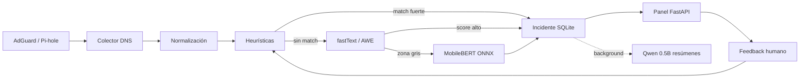

# PiholeBlocker

Filtro de red **local-first** para Raspberry Pi: captura eventos DNS, clasifica riesgo con un pipeline escalonado (heurísticas → modelo ligero → modelo pesado en zona gris) y expone un panel de revisión humana. **No usa LLM generativo en el camino crítico.**

## Arquitectura



### Principios de diseño

| Decisión | Motivo |
|----------|--------|
| DNS-first | HTTPS/ECH/QUIC limitan inspección de contenido; DNS y metadatos son fiables |
| Pipeline escalonado | Latencia baja en la mayoría de muestras; modelo pesado solo en ambigüedad |
| LLM fuera del inline | Clasificación determinista para bloqueo; LLM solo resume/prioriza en panel |
| SQLite local | Offline, privacidad, feedback loop sin dependencias externas |
| Revisión humana | Reduce falsos positivos semánticos (HateXplain, EXIST, datasets ES) |

## Hardware recomendado

| Dispositivo | Rol |
|-------------|-----|
| **Raspberry Pi 5 (4–8 GB)** | Objetivo ideal: DNS + fastText + MobileBERT ocasional + panel |
| **Raspberry Pi 4 Model B** | MVP cómodo con mismos modelos, menos margen de RAM |
| **Raspberry Pi 3 B+** | Solo DNS + heurísticas + fastText |
| **Pi Zero 2 W** | Colector básico, no nodo de inferencia |

## Modelos

| Capa | Modelo | Tamaño | Uso |
|------|--------|--------|-----|
| 0 | Listas + regex | ~KB | Bloqueo inmediato (malware, grooming keywords) |
| 1 | fastText `.ftz` | ~1–2 MB | Clasificación barata por hostname/URL |
| 2 | MobileBERT cuantizado ONNX | ~28 MB | Solo zona gris (score 0.40–0.75) |
| 3 (opcional) | Qwen2.5-0.5B-Instruct Q4 | ~245 MB | Resúmenes de incidentes en panel, **nunca inline** |

Entrena capas 1–2 en máquina de desarrollo (GPU); despliega artefactos a la Pi.

### Datasets sugeridos (ES/EN)

- **EXIST 2023** — bilingüe EN/ES
- **Dataset Multidimensional de Ciberacoso en Español (2025)**
- **OLID**, **HateXplain** — complemento EN
- Corpus propio desde `feedback` + query log etiquetado

## Inicio rápido

```bash
# Clonar e instalar
cd PiholeBlocker
python3 -m venv .venv && source .venv/bin/activate
pip install -e ".[ml]"

# Configuración
cp config/config.example.yaml config/config.yaml
# Editar credenciales AdGuard/Pi-hole

# Modelo fastText de ejemplo (~1 MB)
python scripts/train_fasttext.py

# Arrancar daemon + panel (puerto 8080)
pihole-blocker
```

### Docker (laboratorio)

```bash
docker compose up -d
# AdGuard UI: http://localhost:3000
# Panel PiholeBlocker: http://localhost:8080
```

## Despliegue en Raspberry Pi

```bash
sudo useradd -r -s /bin/false pihole-blocker
sudo mkdir -p /opt/pihole-blocker
sudo cp -r . /opt/pihole-blocker/
cd /opt/pihole-blocker
python3 -m venv .venv
.venv/bin/pip install -e ".[ml]"
sudo cp systemd/pihole-blocker.service /etc/systemd/system/
sudo systemctl enable --now pihole-blocker
```

Apunta el DNS de la red a la Pi (AdGuard/Pi-hole en `:53`).

## API

| Endpoint | Descripción |
|----------|-------------|
| `GET /` | Panel web |
| `GET /health` | Healthcheck |
| `GET /api/stats` | Métricas agregadas |
| `GET /api/incidents` | Lista de incidentes |
| `POST /api/incidents/{id}/feedback` | Veredicto: `tp`, `fp`, `ignore`, `allow_rule` |
| `GET /api/summary` | Resumen LLM opcional |

## Sprints de implementación

### Sprint 1 — DNS-first (actual)
- Colector AdGuard (`GET /control/querylog`) y Pi-hole (REST + SID)
- Persistencia `events` / `incidents` / `feedback`
- Heurísticas + panel básico

### Sprint 2 — Clasificador ligero
- Entrenar fastText con etiquetas: `safe`, `suspicious`, `abusive`, `grooming_risk`
- Cuantizar a `.ftz`
- Ajustar umbrales en `config.yaml`

### Sprint 3 — Segunda pasada
- Exportar MobileBERT cuantizado a ONNX (entrenar en GPU)
- ONNX Runtime CPU Arm en Pi 4/5
- Solo activar en zona gris

### Sprint 4 — Dispositivos gestionados (opcional)
- mitmproxy en modo WireGuard/local capture
- Certificado de confianza en clientes propios
- Aceptar límites: pinning, ECH, DoH/DoQ

## Criterios de éxito

1. Capa ligera: **< 50 ms** por muestra en Pi 4/5
2. Segunda pasada: **< 1 s** en casos ambiguos
3. Operación **offline** con histórico local
4. Reducción de FP tras feedback del administrador

## Límites conocidos

- No lee contenido HTTPS arbitrario sin proxy + certificados
- ECH (RFC 9849) y certificate pinning reducen visibilidad
- El LLM multilingüe pequeño consume RAM; reservarlo para tareas admin
- Actualizar AdGuard/Pi-hole regularmente (seguridad del propio filtro DNS)

## Licencia

MIT (ajustar según necesidad del proyecto).
